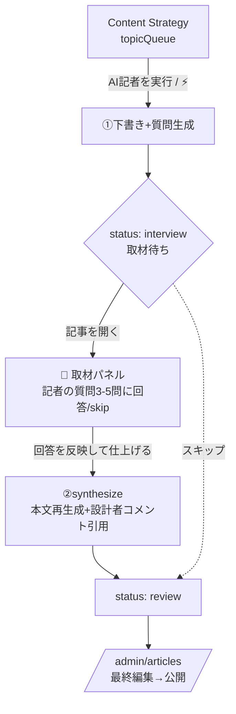

# AIインタビュー記事ワークフロー 仕様（Content Strategy 統合版）

> 目的：既存の Content Strategy（AI記者が下書き→レビュー待ち）に **「担当記者による短いインタビュー」工程を1つ挟む**ことで、AI量産記事と差別化する。事実はAI、意見・実体験はあなた。
> 対象：まず **公式記事（`source: official`）**。S.Blog（`community`）は同じ仕組みを後追いで開放。
> 前提資産：`/admin/strategy`（AdminStrategyPage）・`topicQueue`・`reporters`・`officialArticles`・Cloud Functions（`aggregateWeeklyTrends` / `generateTrendArticle` / `generateKeywordArticle`, `@anthropic-ai/sdk`＋`@google/generative-ai` 両搭載）。
> 更新: 2026-07-02 / Status: Draft（既存実装に接続する差分仕様）

---

## 1. 既存フローと「追加する1工程」

**現状（実装済み）**
```
topicQueue(ネタ) ──[AI記者を実行 / ⚡generateKeywordArticle]──▶ officialArticles(下書き status:review) ──▶ /admin/articles でレビュー・公開
```

**統合後（★が今回の追加。それ以外は現状維持）**
```
topicQueue ──▶ ①AI記者が下書き＋★質問生成 ──▶ ★status:interview(取材待ち)
        ──▶ ②あなたが記者の質問に回答(1-2行/音声/skip可) ──▶ ★synthesize(回答を織り込み再生成)
        ──▶ status:review ──▶ /admin/articles で最終編集・公開
```
- **記者＝インタビュアー**：質問は担当 `reporter` の人格・`tone` で行う（例：🏠佐藤 一級建築士が間取り記事についてあなたに質問）。`reporterId` は既にトピック→記事へ引き継がれている。
- **後方互換**：インタビューを**スキップ**した場合は現状どおり `interview` を素通りして `review` へ（＝今の挙動のまま）。

---

## 2. 画面フロー（既存UIへの最小追加）



**A. Content Strategy 側（AdminStrategyPage）**
- `TOPIC_STATUS` に **`interview`（取材待ち・オレンジ系）** を追加（`generating` と `review` の間）。
- KPIカードに任意で「取材待ち」を追加。カレンダー/キューのステータス表示に反映。

**B. 取材パネル（新規・記事レビュー画面 or モーダル）**
- レビュー待ち一覧で `status:interview` の記事に **「🎤 {記者名}さんから質問があります」バッジ**。
- パネル：質問カードを縦並び、各カードに回答欄（🎤音声入力ボタン付き）＋「スキップ」。全スキップでも「そのまま仕上げる」で進行可。
- フッター：**「回答を反映して仕上げる」**＝ `synthesizeInterviewArticle` を呼ぶ → 完了後 `AdminArticleEditor` の通常編集へ。

配置は `AdminArticleEditor` 上部に折り畳みパネルとして差し込むのが最小改修（下書きは既にそこで開くため）。

---

## 3. データ構造（既存コレクションに追記）

### `officialArticles`（既存フィールドはそのまま。以下を追加）
```jsonc
{
  "source": "official",                 // 既存9記事も official に一括設定。将来 news / community
  "reporterId": "<reporters/doc>",      // 既存(トピックから継承)。author.displayName=記者名
  "aiDrafted": true,
  "interview": {
    "status": "pending | answered | skipped | done",
    "model": "…",                       // 質問生成モデル
    "generatedAt": <Timestamp>,
    "questions": [
      { "id": "q1", "q": "この間取りの肝はどこですか？", "priority": 1,
        "answer": "…(空=スキップ)", "answeredAt": <Timestamp|null> }
    ]
  },
  "provenance": {
    "aiDrafted": true,
    "reporterName": "佐藤 一級建築士",   // 文責(AI記者)
    "interviewedUid": "<uid>",          // 取材・監修=あなた
    "reviewedBy": "<uid>",
    "pullQuotes": [ "…設計者コメントとして本文に埋め込んだ引用…" ]
  }
}
```
- **記事ステータス**に `interview` を追加（`draft → interview → review → published`）。
- **透明性表示**（記事フッター）：「文：{記者名}（AI下書き）／取材・監修：SEKKEIYA」。

### `topicQueue`（`TOPIC_STATUS` に1件追加）
```js
interview: { label: '取材待ち', color: '#fb923c', bg: 'rgba(251,146,60,0.12)' }
```

### `reporters`（変更なし・そのまま活用）
`expertise` / `tone` を**質問生成プロンプトのペルソナ**として流用。追加で任意 `interviewStyle`（質問の切り口メモ）を持たせても良い。

---

## 4. プロンプト設計（3段／既存生成基盤に相乗り）

> モデル：既存 `generateKeywordArticle`＝Gemini。**品質が効く合成(P3)は Claude `claude-opus-4-8`（Anthropic SDK 導入済み）推奨**、質問(P2)は安価モデルでよい。下書き(P1)は現状のまま。

### P1. 下書き（＝既存 `generateKeywordArticle` / `generateTrendArticle` を流用）
- 変更点：本文は従来どおり。ただし**「意見・将来予測・実体験は書かない（後段インタビューで補う）」**を system に一文追加し、事実・手順・比較に寄せる。

### P2. 質問生成（★新規：担当記者の人格で問う）
- persona = `reporter.expertise` / `reporter.tone`。
- 指示：「下書きを読み、**創業者にしか答えられない一次情報**を引き出す質問を3〜5個、重要度順に。事実確認でなく"見解・実体験・実務での使い所"。口頭1〜2行で答えられる粒度。」
- カテゴリ別の切り口：
  - `AI News` → 影響／賛否と理由／自分なら使うか／3年後
  - `official`(リリース) → 作った背景の課題／苦労した点／使ってほしい形／次の一手
  - `Tips / Learn`・`S.Layout` 等 → 実際の使い方／初心者がハマる点／独自のコツ
- 出力(JSON)：`{ questions:[{id,q,priority}] }` → `interview.questions` に保存、`status:interview`。

### P3. 合成（★新規）
- 指示：「下書き＋Q&Aを統合。**回答は言い換えず要旨を活かす**。1〜2箇所を `<blockquote>`＝『設計者コメント』として原文ニュアンスで引用。空回答は無視。独自見解を本文前半へ。末尾にAI下書き＋出典を明記。」
- 出力(JSON)：`{ title, excerpt, bodyHtml, pullQuotes[], seoTitle, seoDescription }` → 記事更新、`status:review`。

---

## 5. API（Cloud Functions v2 / onCall・Admin認証）

`functions/insights/` に、既存関数の隣へ追加。

| Callable | 入力 | 出力 | 備考 |
|---|---|---|---|
| （拡張）`generateKeywordArticle` / `generateTrendArticle` | 既存 + | 生成後に `interview.questions` も作成し `status:interview` | P1＋P2を一括。または下記に分離 |
| （新）`generateInterviewQuestions` | `{ articleId }` | `{ questions[] }` | P1と分離したい場合 |
| （新）`synthesizeInterviewArticle` | `{ articleId }`（回答は記事docから読む） | `{ title, excerpt, bodyHtml, pullQuotes, seoTitle, seoDescription }` | P3。`status:review` に更新 |

- 回答保存は軽量に：フロントから `updateDoc(officialArticles/{id}, { 'interview.questions': [...] })` で直接更新（Functionを介さない）。
- `synthesizeInterviewArticle` は記事docの `interview.answers` を読んで再生成→上書き。中断・再開可。

---

## 6. 実装ステップ（公式記事から）
1. **土台**：`officialArticles` に `source` 追加＋既存9記事を `official` 化。`TOPIC_STATUS`/記事statusに `interview` 追加。
2. **質問生成**：`generateKeywordArticle` を拡張（or `generateInterviewQuestions` 新設）→ 下書きと同時にQを作り `status:interview` へ。
3. **取材パネル**：`AdminArticleEditor` に折り畳みパネル（質問回答・音声・skip）＋「回答を反映して仕上げる」。
4. **合成**：`synthesizeInterviewArticle` 実装 → `status:review` → 既存の公開フローへ合流。
5. **検証**：まず `official`（リリース/Tips）で自分が1本通しで使う。→ 良ければ `AI News`、その後 S.Blog(`community`) に展開。

---

## 7. 公式アカウント & 取材タスク配信（Schedules & Tasks 連携）

> ねらい：取材をCMSの中に閉じ込めず、**あなたが毎日見る Schedules & Tasks のユーザータスク**に自動で出す＝取材が確実に回る（継続性の担保）。

**公式アカウント（`hello@sekkeiya.com`）の登録**
- Firebase Auth に登録し、その `uid` を設定ドキュメントに保存：`config/official = { uid, email:"hello@sekkeiya.com", displayName:"SEKKEIYA" }`。
- 用途3つ：① `officialArticles.author`（公式記事の owner/文責）、② 取材タスクの `assigneeUid`、③ 通知先。

**取材タスクの自動作成（cross-app：同一 Firebase `shapeshare3d`）**
- 下書き＋質問生成の完了時（`generateKeywordArticle` 拡張）に、Cloud Function(admin SDK)が **デスクトップと同じ** `projects/{CONTENT_PROJECT_ID}/tasks` に1件作成：
```jsonc
{
  "type": "review",                       // ★既存のタスク種別を流用（新設不要）
  "title": "🎤 取材：{keyword}（{記者名}から質問{n}件）",
  "status": "todo",
  "assigneeUid": "<official uid>",
  "assigneeName": "SEKKEIYA",
  "dueDate": "<topic.targetWeekStart>",   // 投稿計画の週に合わせる
  "linkUrl": "/admin/articles/{articleId}?tab=interview",
  "articleId": "{articleId}",
  "createdBy": "ai-reporter"
}
```
- 回答完了 or 合成完了で `task.status='done'` に更新（取材パネル or `synthesizeInterviewArticle` から）。
- **専用プロジェクト**「SEKKEIYA Content」を1つ用意し、取材タスク＋投稿スケジュールを集約（Content Strategy の4週カレンダーと役割が揃う）。

**通知チャネル（推奨：軽い順に段階導入）**
1. **アプリ内タスク**（既定）：Schedules & Tasks のユーザータスクに出る＝追加実装ほぼ不要。
2. **メール**（任意）：公式Gmailへ「取材待ちが N 件」ダイジェスト（Cloud Function → Gmail API / nodemailer）。
3. **Push**（将来）：デスクトップ/PWA通知。

**確認事項（要判断）**
- ① `hello@sekkeiya.com` の Firebase Auth 登録と uid の `config/official` への登録（私が管理アクションor設定投入を用意可）。
- ② 取材タスクを載せる **projectId**（新規「SEKKEIYA Content」を作るか、既存プロジェクトに相乗りか）。
- ③ 通知はまず「アプリ内タスクのみ」で開始でよいか（メールは後追い）。

---

## 8. リスク & ガード
- **SEO量産ペナルティ回避**：人間インタビュー必須化で乱造を構造的に抑制。独自見解を前半に。
- **正確性**：公開前レビュー(`reviewedBy`)必須。AI下書き明示。
- **著作権(news時)**：要約＋出典リンク＋帰属。全文転載しない。
- **コスト**：質問=安価モデル、合成のみOpus。下書きは既存基盤のまま。
