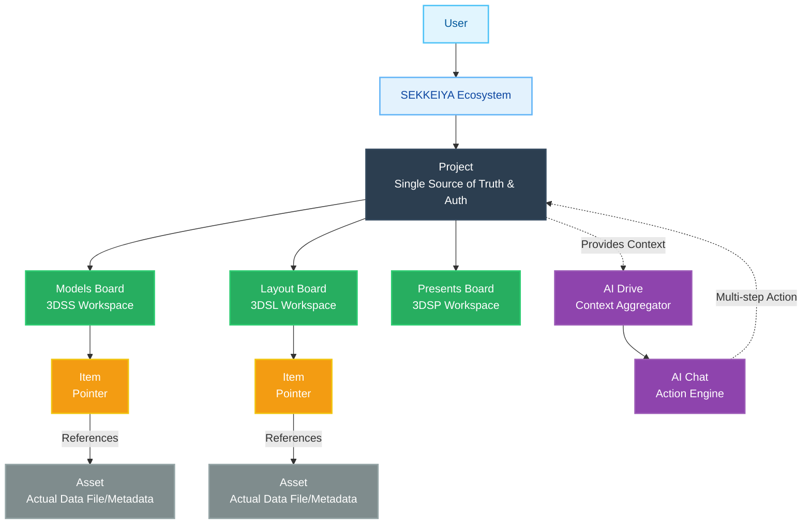

# SEKKEIYA Core Architecture Concept

The SEKKEIYA ecosystem is built on a strict hierarchical structure, clearly separating contexts, workspaces, and data pointers.

## Key Concepts
1. **Project (世界/文脈)**: The ultimate boundary for access control, team membership, and AI context.
2. **Board (作業領域)**: A dedicated workspace for a specific child app (`appScope`).
3. **Item (参照ポインタ)**: A lightweight JSON object existing inside a Board, pointing to the real data.
4. **Asset (実体)**: The physical 3D model, image, or document stored in the user's root storage or public space.
