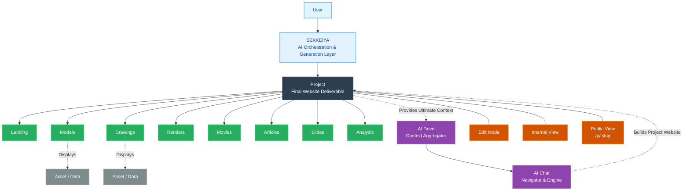

# SEKKEIYA Core Architecture Concept

The SEKKEIYA ecosystem is built on a strict hierarchical structure, treating the **Project** as the Single Source of Truth and the ultimate final deliverable (1 Project = 1 Website). The ecosystem is no longer a collection of isolated apps or "Boards", but a unified suite of tools designed to construct specific sections of the Project Website.

## Key Concepts
1. **SEKKEIYA**: Project Generation & AI Orchestration layer. It is not just a portal, but the OS that builds the Project.
2. **Project (最終成果物)**: Single Source of Truth, representing a complete Web Site. The ultimate boundary for access control, team membership, requirements metadata, and AI context. It supports Edit Mode, Internal View, and Public View.
3. **Section (出力先)**: Sub-directories of the Project Website (Landing, Models, Drawings, Renders, Movies, Articles, Slides, Analysis). Child apps act purely as generation tools targeting these sections.
4. **Asset (実体データ)**: The physical 3D model, image, or document stored in the cloud.
5. **AI**: The engine that drives the completion of the Project Page. AI Chat is the navigator, and AI Drive is the contextual memory.
