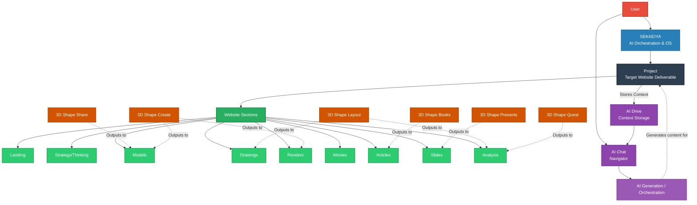

# Core System Map

## 概要 (Overview)
SEKKEIYA エコシステム全体の基本構造を示す最上位のシステムマップです。
SEKKEIYA は「プロジェクト管理アプリ」ではなく、「プロジェクト（Webサイト型の最終成果物）を完成させるための生成システム・OS」として機能します。

```mermaid
flowchart TD
    %% Styling
    classDef default fill:#f9f9f9,stroke:#333,stroke-width:1px,color:#333
    classDef user fill:#e74c3c,stroke:#c0392b,stroke-width:2px,color:#fff
    classDef sekkeiya fill:#2980b9,stroke:#2471a3,stroke-width:2px,color:#fff
    classDef project fill:#2c3e50,stroke:#1a252f,stroke-width:2px,color:#fff
    classDef sections fill:#27ae60,stroke:#1e8449,stroke-width:2px,color:#fff
    classDef section fill:#2ecc71,stroke:#27ae60,stroke-width:2px,color:#fff
    classDef app fill:#d35400,stroke:#ba4a00,stroke-width:2px,color:#fff
    classDef ai fill:#8e44ad,stroke:#7d3c98,stroke-width:2px,color:#fff
    classDef action fill:#9b59b6,stroke:#8e44ad,stroke-width:2px,color:#fff

    User[User]:::user
    Sekkeiya[SEKKEIYA<br>AI Orchestration & OS]:::sekkeiya
    Project[Project<br>Target Website Deliverable]:::project
    Sections[Website Sections]:::sections

    User --> Sekkeiya
    Sekkeiya --> Project
    Project --> Sections

    Sections --> SecLan[Landing]:::section
    Sections --> SecStr[Strategy/Thinking]:::section
    Sections --> SecMod[Models]:::section
    Sections --> SecDra[Drawings]:::section
    Sections --> SecRen[Renders]:::section
    Sections --> SecMov[Movies]:::section
    Sections --> SecArt[Articles]:::section
    Sections --> SecSli[Slides]:::section
    Sections --> SecAna[Analysis]:::section

    App3DSS[3D Shape Share]:::app
    App3DSL[3D Shape Layout]:::app
    App3DSC[3D Shape Create]:::app
    App3DSP[3D Shape Presents]:::app
    App3DSB[3D Shape Books]:::app
    App3DSQ[3D Shape Quest]:::app

    %% App generation mapping
    App3DSS -.->|Outputs to| SecMod
    App3DSL -.->|Outputs to| SecDra
    App3DSL -.->|Outputs to| SecAna
    App3DSC -.->|Outputs to| SecMod
    App3DSC -.->|Outputs to| SecRen
    App3DSP -.->|Outputs to| SecSli
    App3DSB -.->|Outputs to| SecArt
    App3DSQ -.->|Outputs to| SecAna

    Project -->|Stores Context| AIDrive[AI Drive<br>Context Storage]:::ai
    User --> AIChat[AI Chat<br>Navigator]:::ai
    AIDrive --> AIChat

    AIChat --> AIAction[AI Generation / Orchestration]:::action

    AIAction -.->|Generates content for| Project
```
