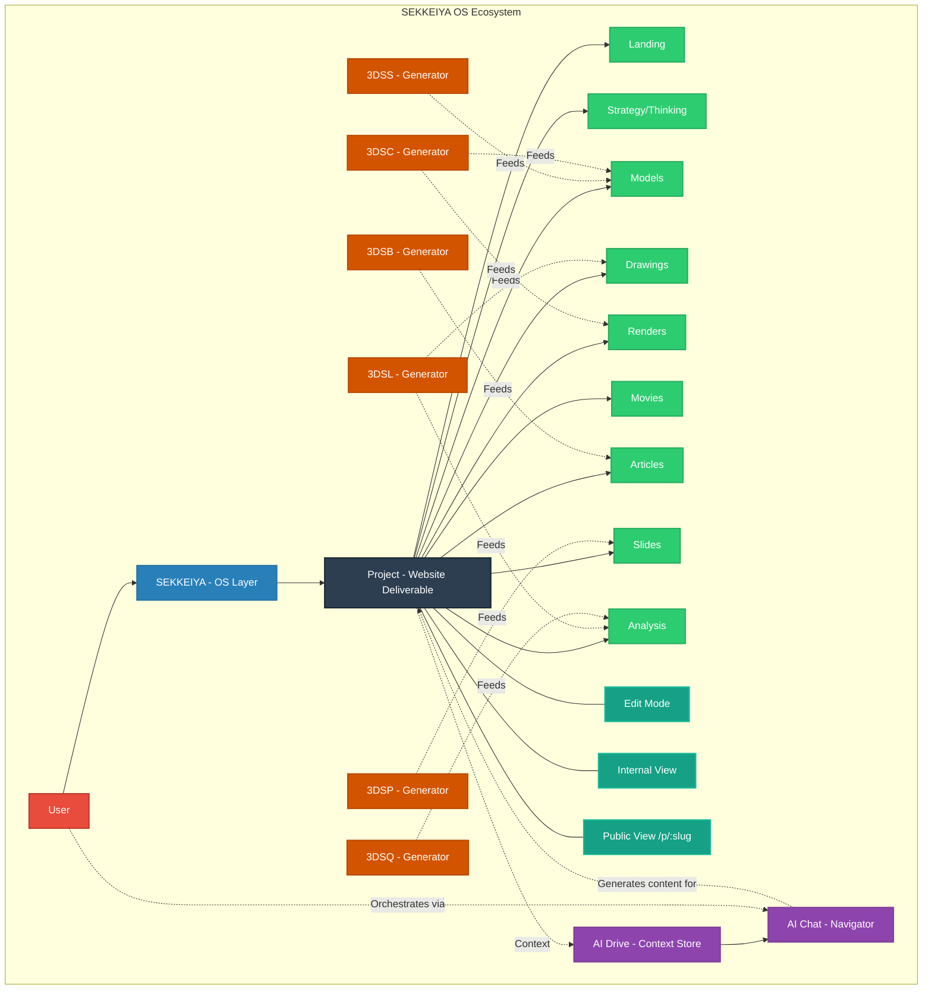

# SEKKEIYA Final System Map (The Architect's Blueprint)

## 概要 (Overview)
このモデルは、SEKKEIYA エコシステムにおける「1 Project = 1 Website」思想を反映した最終アーキテクチャです。SEKKEIYAは単なるポータルではなく、プロジェクトページを完成させるためのOSです。

## 哲学 (Philosophy)
1. **The Ecosystem:** `SEKKEIYA` (プロジェクト全体をオーケストレーションし、生成を司るOS)
2. **The Output:** `Project` (編集・公開可能な最終成果物としてのWebサイト)
3. **The Sections:** `Landing, Models, Drawings, Renders...` (プロジェクトサイトを構成する各セクション)
4. **The Generators:** `Child Apps (3DSS, etc.)` (プロジェクトの特定セクションにアセットとデータを供給するための生産装置)
5. **The Brain:** `AI` (全体を横断し、サイト完成へのガイドと自動生成を行うエンジン)
