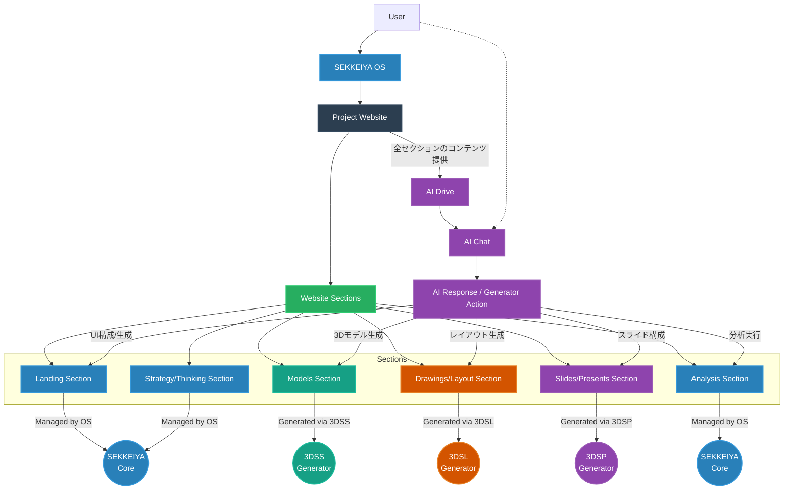

# Project / Generator App Routing Map

## 概要 (Overview)
この図は、SEKKEIYAの「Project Website」内の各セクションが、エコシステム上のどの子アプリ (Generator) によって生成・編集されるかを示す定式的なルーティングマップです。
1 Project = 1 Website のアーキテクチャにおいて、各アプリがプロジェクトの特定の構成要素（Section）を担う形を可視化しています。

## Section-based Routing
Firestore上の Project エンティティ配下には各セクションのサブコレクション（例: `projects/{projectId}/models`）が存在します。
ユーザーが特定セクションの編集（Edit Mode）を開始すると、SEKKEIYA OSはURLパラメータ（`?projectId=XYZ`）と共に適切なジェネレーターアプリ（3DSSなど）へルーティングします。
各ジェネレーターアプリは、Project IDと自身の担当Sectionを知っているため、適切なデータをシームレスに読み書きします。
