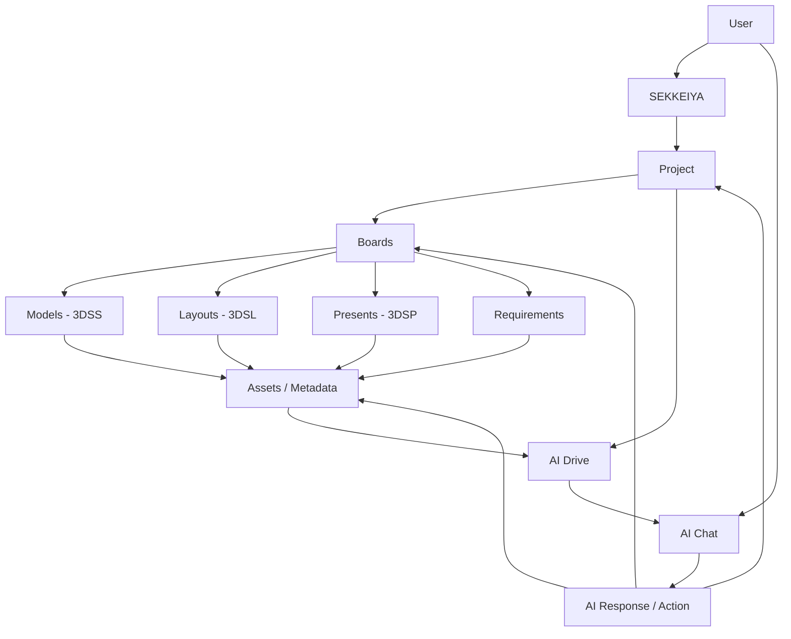

```mermaid
flowchart TD

    U[User]

    U --> S[SEKKEIYA]

    S --> P[Project]

    P --> B[Boards]

    B --> M[Models - 3DSS]
    B --> L[Layouts - 3DSL]
    B --> PR[Presents - 3DSP]
    B --> R[Requirements]

    M --> A[Assets / Metadata]
    L --> A
    PR --> A
    R --> A

    A --> AD[AI Drive]
    P --> AD

    AD --> AC[AI Chat]

    U --> AC

    AC --> AR[AI Response / Action]

    AR --> P
    AR --> B
    AR --> A
```
