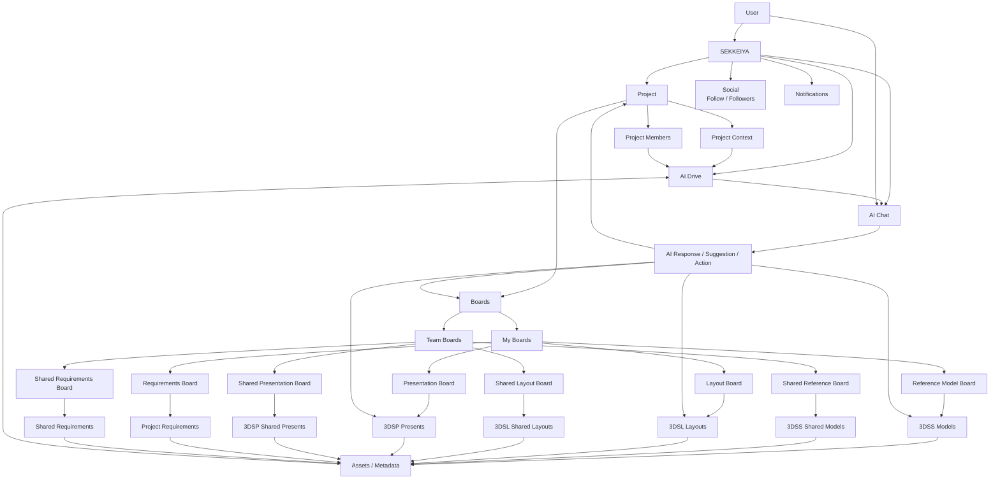

# SEKKEIYA Core System Map

SEKKEIYA の中心構造を 1 枚で表した図です。  
User を起点に、Project、Board、各子アプリの成果物、そして AI Chat / AI Drive がどうつながるかを示します。

```mermaid
flowchart TD
    U[User]

    U --> S[SEKKEIYA]

    S --> P[Project]
    S --> AC[AI Chat]
    S --> AD[AI Drive]
    S --> SO[Social<br/>Follow / Followers]
    S --> NT[Notifications]

    P --> PM[Project Members]
    P --> PC[Project Context]
    P --> B[Boards]

    B --> MB[My Boards]
    B --> TB[Team Boards]

    MB --> RB[Reference Model Board]
    MB --> LB[Layout Board]
    MB --> PB[Presentation Board]
    MB --> QB[Requirements Board]

    TB --> SRB[Shared Reference Board]
    TB --> SLB[Shared Layout Board]
    TB --> SPB[Shared Presentation Board]
    TB --> SQB[Shared Requirements Board]

    RB --> M1[3DSS Models]
    SRB --> M2[3DSS Shared Models]

    LB --> L1[3DSL Layouts]
    SLB --> L2[3DSL Shared Layouts]

    PB --> PR1[3DSP Presents]
    SPB --> PR2[3DSP Shared Presents]

    QB --> R1[Project Requirements]
    SQB --> R2[Shared Requirements]

    M1 --> A1[Assets / Metadata]
    M2 --> A1
    L1 --> A1
    L2 --> A1
    PR1 --> A1
    PR2 --> A1
    R1 --> A1
    R2 --> A1

    A1 --> AD
    PC --> AD
    PM --> AD

    AD --> AC

    U --> AC
    AC --> AR[AI Response / Suggestion / Action]

    AR --> P
    AR --> B
    AR --> M1
    AR --> L1
    AR --> PR1
```
