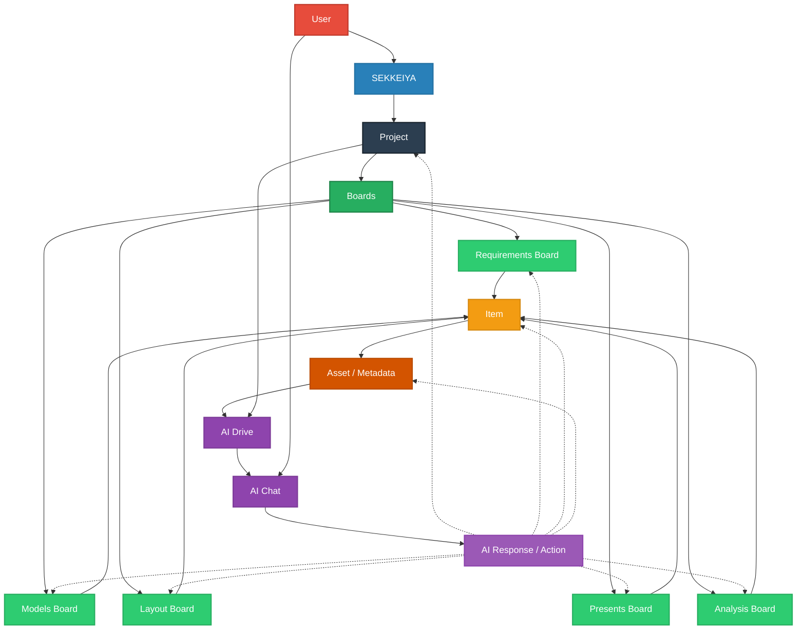

# Core System Map

## 概要 (Overview)
SEKKEIYA エコシステム全体の基本構造を示す最上位のシステムマップです。

```mermaid
flowchart TD
    %% Styling
    classDef default fill:#f9f9f9,stroke:#333,stroke-width:1px,color:#333
    classDef user fill:#e74c3c,stroke:#c0392b,stroke-width:2px,color:#fff
    classDef sekkeiya fill:#2980b9,stroke:#2471a3,stroke-width:2px,color:#fff
    classDef project fill:#2c3e50,stroke:#1a252f,stroke-width:2px,color:#fff
    classDef boards fill:#27ae60,stroke:#1e8449,stroke-width:2px,color:#fff
    classDef board fill:#2ecc71,stroke:#27ae60,stroke-width:2px,color:#fff
    classDef item fill:#f39c12,stroke:#d68910,stroke-width:2px,color:#fff
    classDef asset fill:#d35400,stroke:#ba4a00,stroke-width:2px,color:#fff
    classDef ai fill:#8e44ad,stroke:#7d3c98,stroke-width:2px,color:#fff
    classDef action fill:#9b59b6,stroke:#8e44ad,stroke-width:2px,color:#fff

    User[User]:::user
    Sekkeiya[SEKKEIYA]:::sekkeiya
    Project[Project]:::project
    Boards[Boards]:::boards

    User --> Sekkeiya
    Sekkeiya --> Project
    Project --> Boards

    Boards --> ReqBoard[Requirements Board]:::board
    Boards --> ModBoard[Models Board]:::board
    Boards --> LayBoard[Layout Board]:::board
    Boards --> PreBoard[Presents Board]:::board
    Boards --> AnaBoard[Analysis Board]:::board

    ReqBoard --> Item[Item]:::item
    ModBoard --> Item
    LayBoard --> Item
    PreBoard --> Item
    AnaBoard --> Item

    Item --> Asset[Asset / Metadata]:::asset

    Asset --> AIDrive[AI Drive]:::ai
    Project --> AIDrive

    AIDrive --> AIChat[AI Chat]:::ai
    User --> AIChat

    AIChat --> AIAction[AI Response / Action]:::action

    AIAction -.-> Project
    AIAction -.-> ReqBoard
    AIAction -.-> ModBoard
    AIAction -.-> LayBoard
    AIAction -.-> PreBoard
    AIAction -.-> AnaBoard
    AIAction -.-> Item
    AIAction -.-> Asset
```
