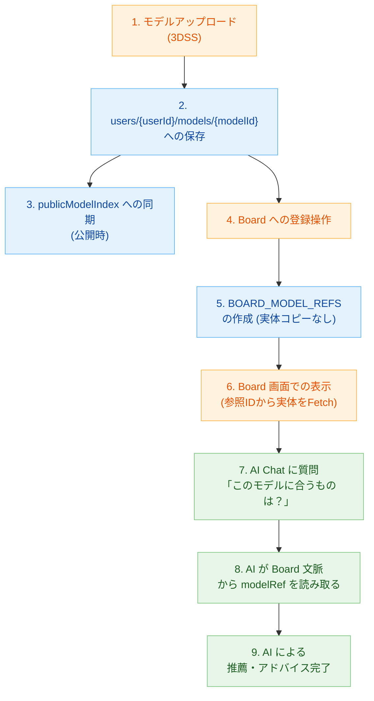

# 3Dモデル データフロー (Data Flow)

3Dモデルがアップロードされてから、Board に登録され、AI Chat や AI Drive で活用されるまでの一連の流れです。将来のAI連携を見据えた構造になっています。

**補足説明:**
- 実体モデルデータは一度しか保存されず（`users/{uid}/models`）、以降の全ての利用（Board、AI分析など）は参照（modelRef）を介して行われます。
- AI Chat や AI Drive からデータにアプローチする際も、この参照ツリーを辿ることで「現在のプロジェクトやBoardで扱っている具体的な資産」を安全かつ高速に把握できます。
