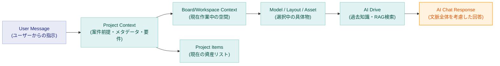

# AI Context Map

ユーザーの入力したチャットメッセージに対して、AIがどのようにコンテキスト（背景情報）を読み解いて回答を生成するかのアプローチ図です。

**補足説明:**
- ユーザーからの短い一言（例:「これに合うテーブルは？」）は、SEKKEIYAの階層を伝播することで詳細な「文脈」として具体化されます。
- 現在開いている**Project**（何の案件か？予算は？コンセプトは？）→ **Workspace**（どの作業中か？）→ **Items**（今プロジェクトに何があるか？）→ 選択中の**Asset**（これ、の指す実体）に変換された上で、過去の知見や類似データ（**AI Drive**）を検索し、高精度なAI応答を返します。
- 旧時代に検討された「要件を集めたRequirements Board」を探す手間はなく、Project自体が常にMetadataとして要件をAIにブロードキャストします。
