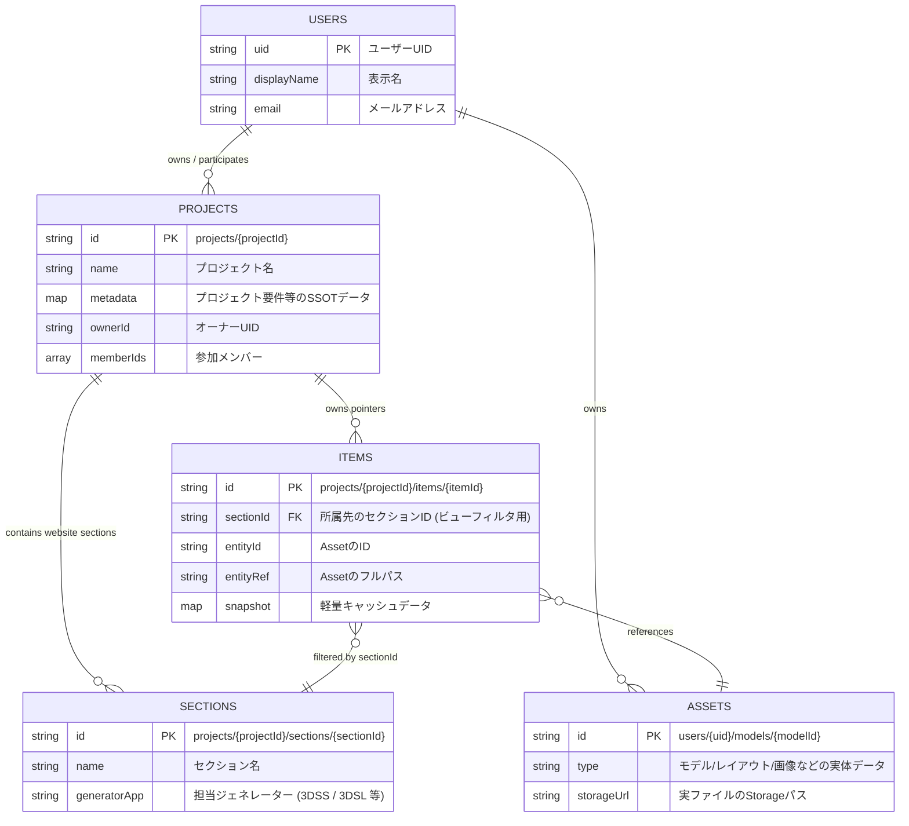

# Firestore ER Diagram

## 概要 (Overview)
SEKKEIYA エコシステム全体の設計を反映した Firestore スキーマの ER 図です。
旧構造の「My Boards / Team Boards」は廃止され、「Project (1 Website) → Sections & Items → Asset」という一貫した階層モデルに完全に統一されています。

## 設計思想
1. **SSOT (Single Source of Truth):**
   - ユーザーの権限やコンテキストの起点は全て「Project」です。
   - 3Dモデルなどのバイナリや重い実データは「Asset」として独立して保存されます。
   - 昔「Requirements Board」として管理しようとしていたメタデータ・要件は、Project ドキュメント自体の中に統合されました。
2. **参照モデル:**
   - 「Item」は「Asset」のポインタです（`entityRef`）。
   - Project内の各Section（構成要素）は、Project内に保存されたItem群のうち、自身に紐づく(`sectionId`が一致する)Itemのみをフィルタリングして表示します。
