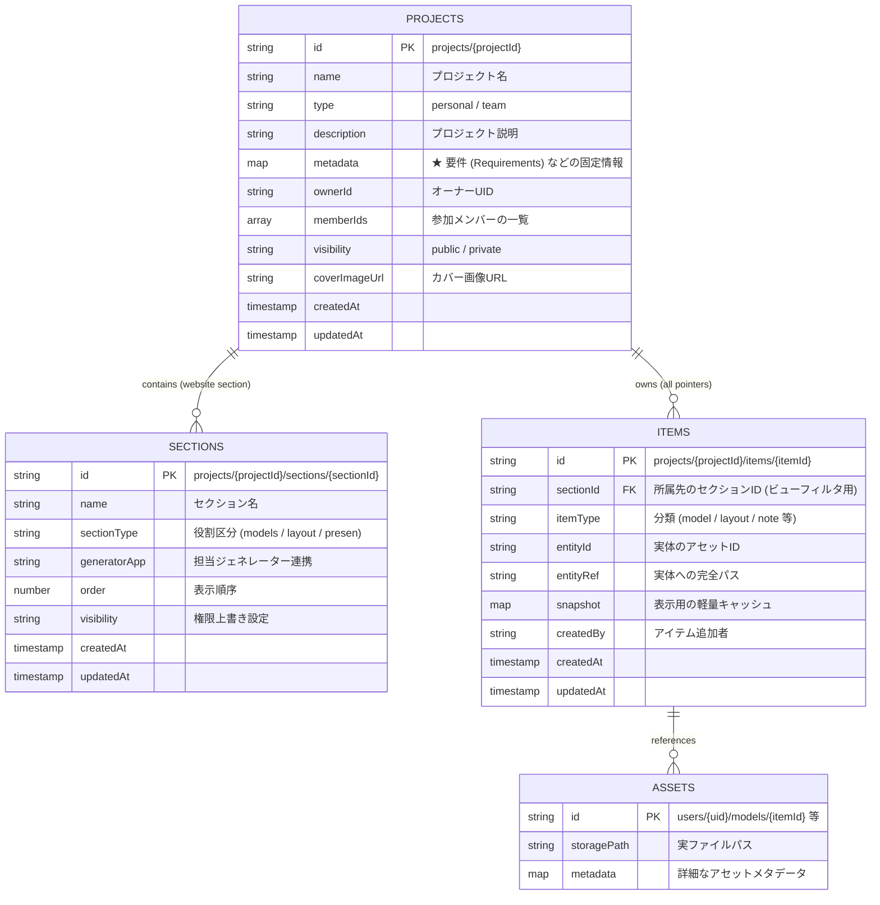

# Project / Section / Item ER Diagram

## 概要 (Overview)
この図は、SEKKEIYA エコシステムにおける新しい Firestore スキーマ（Project Website Architecture）のエンティティリレーション (ER) を表しています。
「Project が最も外側の世界(Website)であり、Section はその構成要素、Item がその中身への参照である」という原則モデルです。

## 制約と思想 (Constraints & Philosophy)
1. **Projects コレクション:** 全ての Single Source of Truth。要件情報(Requirements)はSectionではなくここに保存されます。
2. **Sections サブコレクション:** Websiteの各構成要素 (Section)。実体データは持ちません。
3. **Items サブコレクション:** データの実体は全て `projects/{projectId}/items` にフラットに格納されます。`sectionId` フィールドを用いて所属セクションの出し分けを行います。移動時にはこの外部キーを変更するだけで済みます。
4. **Item は「参照」:** 巨大なデータ本体(Asset)を丸ごとコピーするのではなく、ポインターとして管理します。
