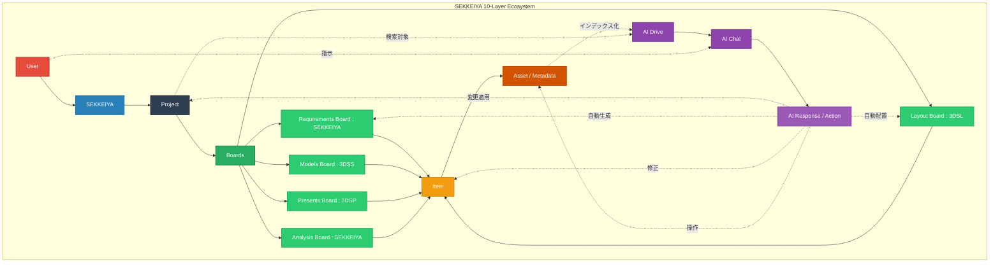

# SEKKEIYA Final System Map (The Architect's Blueprint)

## 概要 (Overview)
このモデルは、SEKKEIYA エコシステムにおけるデータとコンテキストの最終的な統一アーキテクチャを示すマスタップです。すべての開発者・AIエージェントは、実装時にこの階層と依存関係を厳格に遵守する必要があります。

## 哲学 (Philosophy)
1. **The World:** `Project` (案件・企画の境界線であり、権限と文脈のコンテナ)
2. **The Workspace:** `Board` (ユーザーとアプリ間の担当ごとの作業領域)
3. **The Pointer:** `Item` (各Boardにピン留めされた、実体への軽量な参照)
4. **The Content:** `Asset` (3Dモデルファイルやメモなどの重い実体データ)
5. **The Brain:** `AI` (全体を俯瞰し横断的にユーザーを助け、自律アクションを起こす主体)
