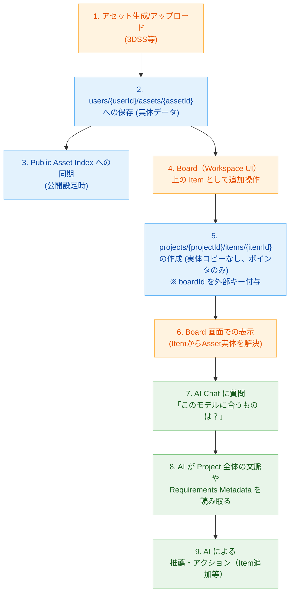

# Asset データフロー (Data Flow)

成果物（Asset）が作成されてから、Project に登録され、AI Chat や AI Drive で活用されるまでの一連の流れです。Projectを単一の真実の情報源(SSOT)とする堅牢な構造になっています。

**補足説明:**
- 実体データは一度しか保存されず（`users/{uid}/assets` や `users/{uid}/models`）、以降の全ての利用（Project内の配置、複数Board間での使い回し、AI分析など）は Project に属する参照ポインタ（Item）を介して行われます。
- Workspace（Board）は単に「`boardId` が自分と一致するItemをフィルタリング表示しているだけのView」です。
- AI Chat や AI Drive からデータにアプローチする際も、この参照ツリーを辿ることで「現在のプロジェクトで扱っている具体的な資産」や「プロジェクト要件(Requirements)」を安全かつ高速に把握できます。
