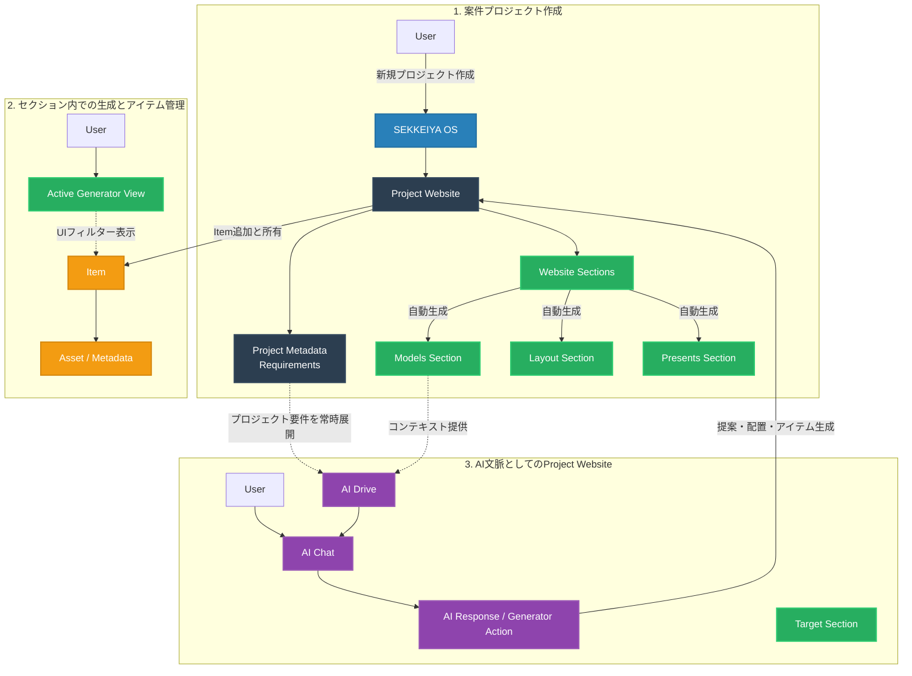

# Project Generation & Lifecycle Flow Diagram

## 概要 (Overview)
この図は、SEKKEIYA エコシステムにおいて、プロジェクトが作成され、標準セクションが自動生成され、AIコンテキストがどのように読み書きされるかを示す構造図です。ユーザーの「MyBoard / TeamBoard」時代から完全な「1 Project = 1 Website」制にシフトしています。

## フローの重要ポイント
1. **SSOTの集中:** ユーザーが Project を生成した瞬間、`metadata` に要件を保存でき、Sections を経由して各ジェネレーターアプリへ遷移します。
2. **すべてのアイテムはプロジェクトへ:** 操作は Generator(Section) のUIで行われますが、Firestore上の保存はすべて `projects/{projectId}/items` に対して行われます。
3. **AIによる全体把握:** AI Chat は Project そのものの要件や全アイテムを包括的に把握できるため、単一のセクションに縛られない俯瞰的な提案とWebsiteの構成が可能です。
