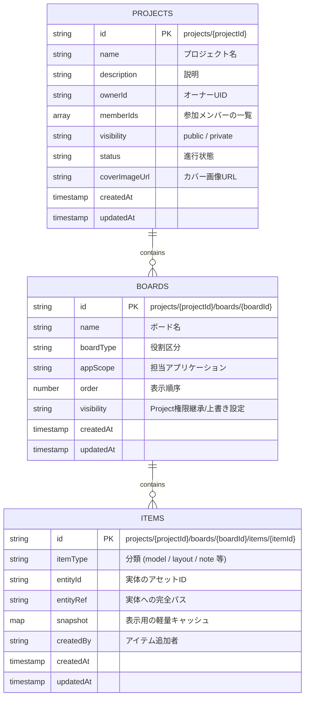

# Project / Board / Item ER Diagram

## 概要 (Overview)
この図は、SEKKEIYA エコシステムにおける新しい Firestore スキーマの基本エンティティリレーション (ER) を表しています。
「Project が最も外側の世界であり、Board がその作業空間、Item がその中身への参照である」という原則モデルです。

## 制約と思想 (Constraints & Philosophy)
1. **Projects コレクション:** 階層の最上位に `projects` が存在します。
2. **Boards サブコレクション:** 当該 Project 専用の Board 群を保持します。
3. **Items サブコレクション:** 実際のデータをリスト化します。
4. **Item は「参照」:** 巨大なデータ本体(Asset)を丸ごとコピーするのではなく、Item は Asset(`entityRef`) に対するポインターとして管理します。
