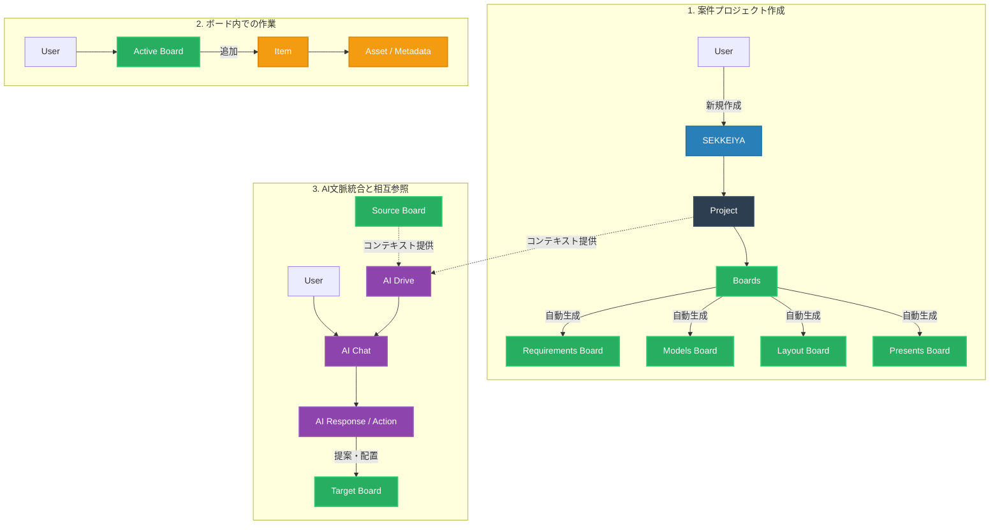

# Project / Board Lifecycle & Flow Diagram

## 概要 (Overview)
この図は、SEKKEIYA エコシステムにおいて、プロジェクトが作成され、標準ボードが自動生成され、AIコンテキストがどのように読み書きされるかを示す Mermaid 構造図です。すべての要素は基本的なコアシステムマップの層（User → SEKKEIYA → Project → Boards → Board → Item → Asset → AI Drive → AI Chat → AI Response）に準拠しています。

## フローの重要ポイント
1. **即座の環境構築:** ユーザーが Project を生成した瞬間、Boards を経由して要件定義からプレゼンまでを網羅する空の Board 群が生成されます。
2. **アイテムの独立と参照:** 操作は常に Board 内の Item として格納され、実体は Asset として存在します。
3. **AIによるクロスボーディング:** AI Chat は AI Drive を通じて Project 全体のコンテキストを読み取り、現在の Board だけでなく他の Board（Source Board 等）をまたいで AI Response / Action を返します。
