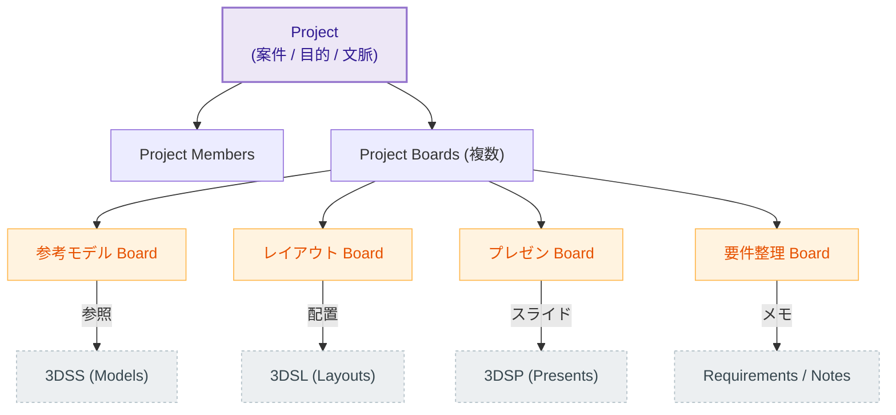

# Project vs Board マップ

Project（案件・目的）と Board（作業・分類空間）の階層定義、および各サブアプリとの繋がりを示します。

**補足説明:**
- **Project**: 「何の目的で集まっているか（案件名など）」のコンテナ。全体をまとめる権限や参加者の単位です。
- **Board**: Project内で生じる「用途別・作業別の空間」。
- 例：ひとつのProject（カフェ内装設計など）の中に、モデリングのインスピレーションを集めるBoard、実際のレイアウト図（3DSL）を集めるBoard、会議用のプレゼン（3DSP）をまとめるBoardなどが論理的に並列して存在します。
