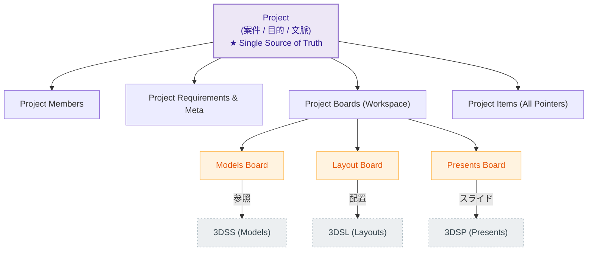

# Project vs Board マップ

Project（案件・目的）と Board（作業・分類空間）の階層定義、および各サブアプリとの繋がりを示します。

**補足説明:**
- **Project**: 「何の目的で集まっているかのコンテナ（SSOT）」。全体をまとめる権限、参加者の単位、またAIが解釈すべき要件（Requirements）はここに格納される。
- **Board**: Project内で生じる「用途別・作業別の空間（Workspace）」。
- 例：ひとつのProject（カフェ内装設計など）の中に、モデリングのインスピレーションを集めるModels Board、実際のレイアウト図（3DSL）を集めるLayout Board、会議用のプレゼン（3DSP）をまとめるPresents Boardなどが論理的に並列して存在します。要件自体はProject直下のMetadataとして管理されます。
