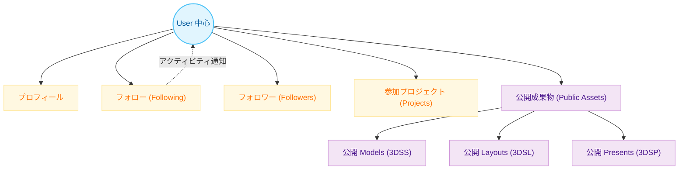

# ユーザー＆ソーシャルマップ

ユーザーを中心としたソーシャルグラフと、公開される成果物との関連性を示します。

**補足説明:**
- ユーザー同士はフォロー関係を持ち、相互のアクティビティ（公開モデルの追加など）をタイムライン等でウォッチできます。
- 個人が作成した各子アプリの資産（Models, Layouts, Presentsなど）のうち、`isPublic = true` なものだけが `Public Assets` として集約・インデックス（例: `publicModelIndex`）化され、他ユーザーの横断検索機能の対象となります。
