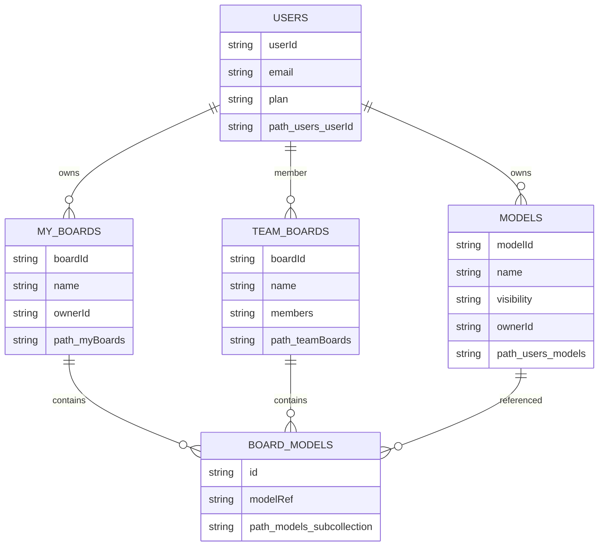

# Firestore ER Diagram (Advanced)

```mermaid
erDiagram

    USERS ||--o{ MY_BOARDS : owns
    USERS ||--o{ TEAM_BOARDS : member
    USERS ||--o{ MODELS : owns

    MY_BOARDS ||--o{ BOARD_MODELS : contains
    TEAM_BOARDS ||--o{ BOARD_MODELS : contains

    MODELS ||--o{ BOARD_MODELS : referenced

    USERS {
        string userId
        string email
        string plan
        string path_users_userId
    }

    MODELS {
        string modelId
        string name
        string visibility
        string ownerId
        string path_users_models
    }

    MY_BOARDS {
        string boardId
        string name
        string ownerId
        string path_myBoards
    }

    TEAM_BOARDS {
        string boardId
        string name
        string members
        string path_teamBoards
    }

    BOARD_MODELS {
        string id
        string modelRef
        string path_models_subcollection
    }
```
