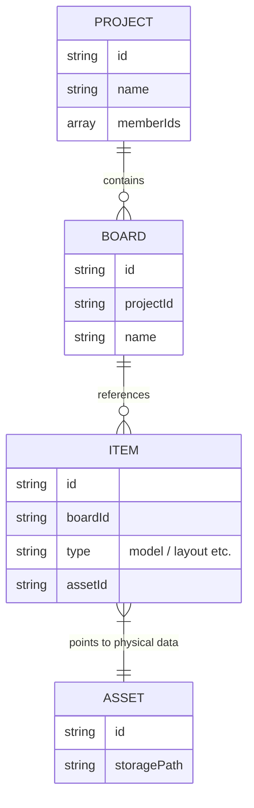

# Phase 10: "Project OS" Architecture Plan

## 1. 目的と範囲
SEKKEIYAを単なる親アプリの枠を超え、「複数アプリを統合実行するOS」として進化させるフェーズです。
これまでのフェーズで完成した「Project -> Board -> Item」の統一データ構造を基盤とし、**「Board を SEKKEIYA 全体の実行コンテキスト（仮想デスクトップ/ワークスペース）として扱う」**新しいアーキテクチャを確立します。

これにより、ユーザーが各子アプリ間をシームレスに移動しても、「いま対象としている空間・タスク（＝Board）」の文脈を失わず、AI や Drive などの OS 共通機能がその文脈を的確に支援できる状態を目指します。

---

## 2. 実行コンテキストの統一 (Project / Board / Item の責務)

新アーキテクチャにおいて、各階層の役割は以下の通り強固に定義されます。

### 導入順序の明確化
- **現フェーズ**: まずは **Board** をOSの最小の実行単位（コンテキスト）として先行実装・統合します。
- **次段階以降**: **Project** は、複数のBoardを束ねる上位の所有・権限・整理単位として段階的に導入します。

### 責務定義
- **Project**: 「世界」
  - ユーザーやチームの活動の最大単位。権限管理や課金、大枠の設定を共有するスコープ。
- **Board**: 「実行コンテキスト（アクティブな作業領域）」
  - SEKKEIYA OS 上で展開される「現在のコンテキスト」。
  - 複数アプリ間で共有されるグローバル状態であり、Chat や Drive の動作は**必ず現在アクティブな Board の環境・権限に依存**して動作する。
- **Item**: 「ポインタ（各アプリ機能へのマッピング）」
  - 各子アプリで扱う実データや 3D表示などへの参照（ショートカット）。Board の構成要素。
- **Asset**: 「物理実体」
  - Storage 上の 3Dモデルファイル、画像ファイル等のバイナリ実体。Item によって参照される。

---

## 3. アプリケーション接続方針

### 各アプリの役割
- **3DSS (Share)**: 3Dモデル特化のビューア・詳細設定。Board 内の特定 Item (type: model) の表示。
- **3DSL (Layout)**: 空間への複数モデル配置とレイアウト構成。Board 内の Item (type: layout) の編集。
- **3DSP (Presents)**: プレゼンテーションシナリオ構築。Board 内の資料 Item の編集。
- **3DSC (Create)**: AIによる新規3D生成。生成完了した Asset は、即座に「現在のアクティブ Board」へ新規 Item として Publish される。
- **3DSB (Books)**: 仕様書やマニュアル等のテキスト/画像ベースの情報表示。
- **3DSQ (Quest)**: トレーニング・ミッション。

### データアクセス・基本ルール
子アプリ（3DSS / 3DSL など）のデータアクセス方針は「一切DBを触らない」ではなく、以下のルールに従います。
1. **独自スキーマの禁止**: 子アプリ自身で独自の root collection 等を編成・保持しない。
2. **共通データレイヤーの利用**: SEKKEIYA標準の `BoardContext` が提供するコンテキスト（activeBoardId 等）に基づき、`global-panel` 等の共有データアクセス層を通じてデータのCRUDを行う。

---

## 4. OS 共通モジュール・UI統合方針 (BoardContext / URL同期 / null state)

### 4.1 BoardContext (エクスパンダブルな Global OS Context)
BoardContext は単なるIDの保持だけでなく、将来的なOSとしての拡張を見据えたRuntime Contextとして定義します。
- **管理される主な状態**:
  - `activeBoardId`
  - `activeProjectId` (将来用)
  - `activeApp` (3DSS, 3DSL などの現在のアプリ識別子)
  - `activeItemId` / `selectedItemIds` (選択中のフォーカス対象)
  - `permissions` (コンテキスト内におけるユーザーの権限レベル)
- **URL同期方針**:
  - `boardId` などのコンテキスト情報は URL と常に同期させます (例: `/app/share?boardId=xxx`)。
  - リロード時やユーザー間での共有リンクアクセス時にも、URLから Board 文脈が自動的に復元されるようにします。

### 4.2 Board 未選択時 (Null State) の挙動
実行コンテキスト (Board) が存在しない状態での各モジュールの振る舞い：
- **Child App**: アプリの枠自体は表示されるが、「ボードが選択されていません」というプレースホルダー表示、または最近使用したBoardのリストを提示する。
- **AI Drive (Asset Manager)**: 「My Boards」などのグローバルなボード一覧、または「ボードを選択してファイルを表示」という案内のみを表示する。
- **AI Chat (Contextual Agent)**: Board固有の RAG は行わず、一般的なシステム案内や「どのボードで作業を開始しますか？」といったOSレベルのアシスタントとして振る舞う。

### 4.3 UI統合コンポーネント
- **MiniSidebar (OS Launcher)**: SEKKEIYAの左端（または右端）に常駐し、アクティブな Board コンテキストを維持したままアプリ間をシームレスに移動（App Switcher）するハブ。
- **AI Drive**: その Board に紐づく全ての実ファイル (Assets) と Item をドラッグ＆ドロップで子アプリに供給する OS Explorer。
- **AI Chat**: `activeBoardId` や `activeItemId` を把握し、現在開いている空間に対して的確な回答や Function Calling を行うアシスタント。

---

## 5. ダイアグラム

### 5.1 Runtime Architecture Diagram
コンテキストの伝播と、UIコンポーネント・アプリ間の連携を示す実行時のアーキテクチャ図です。

```mermaid
graph TD
  OS[SEKKEIYA OS Context Provider]
  URL((URL State<br/>?boardId=...))

  subgraph Runtime Context
    Context[(Board Context)]
    Context -. syncs with .-> URL
  end

  subgraph OS Global UI
    Sidebar[MiniSidebar<br/>App Switcher]
    Chat[AI Chat Panel<br/>Context-Aware]
    Drive[AI Drive Panel<br/>Asset Management]
  end

  subgraph Child Applications (Consumers)
    App1[3DSL / Layout]
    App2[3DSS / Share]
    App3[3DSC / Create]
  end
  
  OS --> Context
  Context --> Sidebar
  Sidebar -. Switch Active App .-> Context
  
  Context --> Chat
  Context --> Drive
  
  Context == inject ==o App1
  Context == inject ==o App2
  Context == inject ==o App3
  
  Drive -. Drag & Drop Assets .-> App1
```

### 5.2 Entity Relationship Diagram (Persistent Data)
DB(Firestore)上の永続的なデータの依存関係を示すER図です。`BoardContext` はここには含まれません。



## 次のステップ (実装着手点)
1. **BoardContext Provider の新設**: 拡張可能な Runtime Context 基盤を構築する。
2. **URLとの同期**: URL パラメータと `activeBoardId` 等の同期メカニズムを実装する。
3. **OS UIへのコンテキスト注入**: MiniSidebar / AI Drive / AI Chat が Context を参照して動作するようにする。
4. **子アプリへの BoardId 伝播**: アプリケーションマウント時に BoardContext を注入する基盤を整備する。
