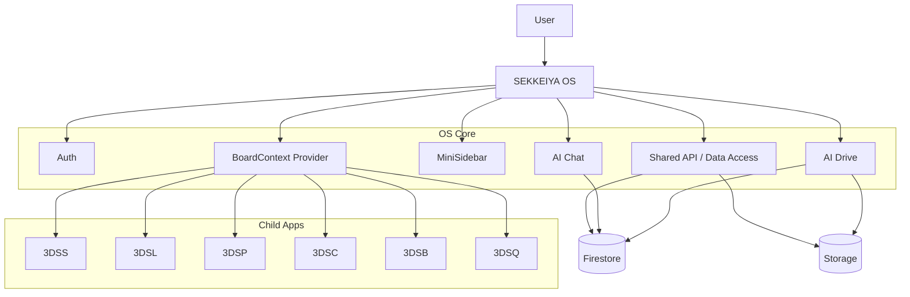
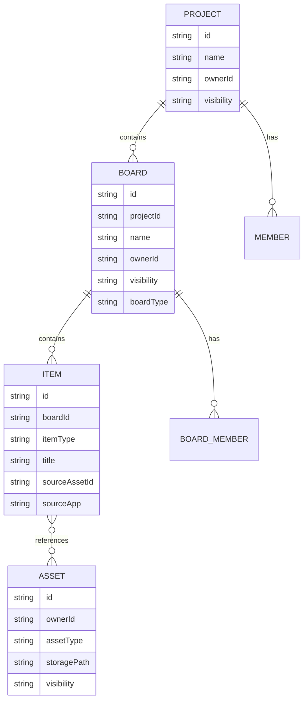
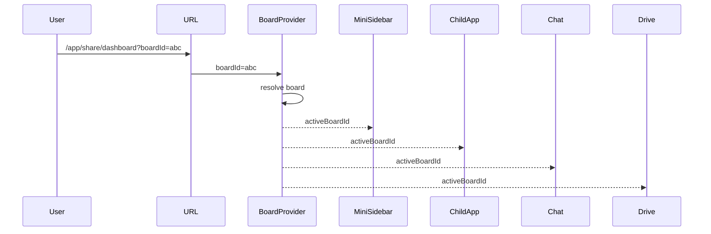
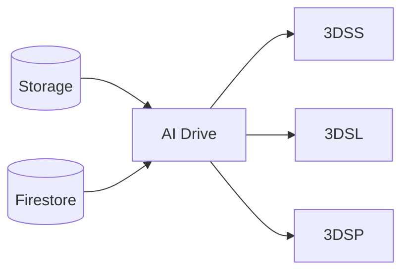

# SEKKEIYA 各種設計図（完成版ドラフト）

## 0. 目的

この文書は、SEKKEIYA エコシステム全体の設計図を一つにまとめた完成版ドラフトです。主に以下を固定することを目的とします。

* SEKKEIYA を親アプリではなく **OS レイヤー** として定義する
* `Project > Board > Item > Asset` の責務を固定する
* Firestore / Storage の正規構造を明文化する
* 3DSS / 3DSL / 3DSP を中心とした子アプリ責務を分離する
* AI Drive / AI Chat / MiniSidebar / BoardContext の統合方針を定める

---

## 1. 全体アーキテクチャ

### 1.1 基本方針

SEKKEIYA は以下の 3 層で構成される。

1. **OS Layer（SEKKEIYA 本体）**

   * 認証
   * BoardContext
   * MiniSidebar
   * AI Drive
   * AI Chat
   * 共通ナビゲーション
   * 共通データアクセス層

2. **App Layer（子アプリ群）**

   * 3DSS
   * 3DSL
   * 3DSP
   * 3DSC
   * 3DSB
   * 3DSQ

3. **Data Layer**

   * Firestore
   * Storage
   * Functions / API

### 1.2 原則

* 子アプリは**独自 root schema を増やさない**
* 実行コンテキストは常に **Board**
* URL の `?boardId=` を BoardContext の Single Source of Truth とする
* OS レイヤーは常駐し、子アプリ切り替え時も維持される
* 子アプリは BoardContext を受けて動く「作業アプリ」として振る舞う

### 1.3 システム構造図



---

## 2. Project / Board / Item / Asset 設計

## 2.1 基本概念

### Project

最上位の所有・権限・整理単位。チーム、請求、上位のテーマ、クライアント案件などを束ねる概念。

### Board

SEKKEIYA OS における **実行コンテキスト**。ユーザーが今開いている作業空間。子アプリはこの Board を前提に動作する。

### Item

Board の中に存在する論理要素。モデル、レイアウト、スライド、記事、分析結果など、各アプリで扱う対象への参照・構成単位。

### Asset

Storage 上の物理ファイル実体。3Dモデル、画像、動画、ドキュメントなど。Item が Asset を参照する。

## 2.2 導入順序

現フェーズでは、**Board を最小の実行単位として先行実装**する。Project は上位概念として定義するが、運用上は段階導入とする。

* Phase 現在: Board 中心
* 次段階: Project による複数 Board の整理
* 将来: Project 権限・課金・横断分析の本格導入

## 2.3 責務整理

| 概念      | 主責務           | 今の優先度 |
| ------- | ------------- | ----: |
| Project | 所有、権限、上位整理    |     中 |
| Board   | 実行コンテキスト、作業領域 |   最優先 |
| Item    | 各アプリ対象の論理単位   |     高 |
| Asset   | ファイル実体        |     高 |

## 2.4 ER 図



---

## 3. BoardContext 設計

## 3.1 基本方針

* `?boardId=` を URL 上の正とする
* React Context は URL を解釈したランタイムキャッシュとして扱う
* App Switcher や MiniSidebar は `boardId` を保持して遷移する

## 3.2 最低限持つ状態

* `activeBoardId`
* `activeBoard`
* `boardResolved`
* `boardNotFound`
* `activeApp`
* `setActiveBoardId`

## 3.3 将来拡張

* `activeProjectId`
* `activeItemId`
* `selectedItemIds`
* `permissions`
* `viewMode`
* `panelState`

## 3.4 振る舞い

* Board 未選択時

  * Chat: Global mode
  * Drive: Global mode or empty state
  * 子アプリ: 「Boardを選択してください」
* 無効 `boardId` 時

  * クラッシュしない
  * Global fallback または not found 通知

## 3.5 フロー図



---

## 4. Firestore Source of Truth

## 4.1 原則

* Firestore の正規構造は **Unified Schema** に従う
* 旧 `myBoards` / `teamBoards` などは廃止済み
* 子アプリは Board / Item / Asset 構造に従う
* 公開用ミラーが必要な場合のみ専用コレクションを許容する

## 4.2 正規コレクション

| Collection         | 用途            | 正規性 |
| ------------------ | ------------- | --- |
| `boards`           | Board の正規実体   | 正規  |
| `boardsPublic`     | 公開ボードのミラー     | 補助  |
| `users`            | ユーザープロファイル・設定 | 正規  |
| `plans`            | プラン情報         | 正規  |
| `tags`             | 検索・メタデータ      | 正規  |
| `usernames`        | ハンドル管理        | 正規  |
| `officialArticles` | 公式記事          | 正規  |
| `projects`         | 上位整理単位（段階導入）  | 準正規 |

## 4.3 Board 関連の正規パス（概念）

```text
boards/{boardId}
boards/{boardId}/items/{itemId}
boards/{boardId}/articles/{articleId}
boards/{boardId}/chats/{chatId}
```

※ 現実実装が一部ずれている場合も、今後の正規方針は上記に寄せる。

## 4.4 Asset 関連

```text
users/{uid}/models/{modelId}
users/{uid}/driveAssets/{assetId}
```

* `models` は主に 3DSS のアップロードソース
* `driveAssets` は AI Drive / 検索向け補助インデックス
* 長期的には `Asset` 概念で整理統合する

## 4.5 廃止済み構造

* `teamBoards`
* `users/{uid}/myBoards`
* `teamBoardInvitations`
* `layoutShares`
* `viewerShares`
* 旧 `articles` ルート配置

## 4.6 新規追加ルール

* 新しい子アプリ専用 root collection を増やさない
* まず `boards/{boardId}/items` で表現できるかを検討する
* 補助 index を追加する場合は source of truth を明示する

---

## 5. App Responsibility Map

| App  | 主役         | 主な Item                    | 主用途         |
| ---- | ---------- | -------------------------- | ----------- |
| 3DSS | モデル        | `model`                    | モデル閲覧・管理・共有 |
| 3DSL | レイアウト      | `layout`                   | 配置・空間編集     |
| 3DSP | プレゼン       | `slide`, `presentation`    | 構成・伝達       |
| 3DSC | 生成         | `generated-model`          | AI 生成       |
| 3DSB | 文書 / ストーリー | `book`, `story`, `article` | 読む・整理する     |
| 3DSQ | 学習 / クエスト  | `quest`, `learning-path`   | 学習導線        |

---

## 6. 3DSS 設計図

## 6.1 役割

3DSS は **モデル特化の閲覧・管理・共有アプリ**。主に 3Dモデルのアップロード、分類、検索、公開・非公開管理、Board への紐付けを担う。

## 6.2 主な画面

* Dashboard
* Open Models
* Private Models
* Board Models
* Upload
* Model Preview

## 6.3 主に扱う Item / Asset

* Item: `model`
* Asset: 3D model files (`glb`, `3dm`, `blend`), thumbnail images

## 6.4 読むデータ

* `users/{uid}/models`
* `boards/{boardId}/items`（将来的正規）
* `boardsPublic`
* `tags`
* `driveAssets`

## 6.5 書くデータ

* `users/{uid}/models`
* Board 上の model item 参照
* thumbnail / metadata / tags

## 6.6 Project / Board との関係

* Board 内では `model` Item の供給源
* Board から見れば「モデル資産ライブラリ」
* 3DSL / 3DSP に再利用される上流アプリ

## 6.7 AI Drive との関係

* アップロードしたモデルは AI Drive から横断利用可能
* metadata / tag / search index 生成の入口

## 6.8 AI Chat との関係

* モデル検索
* 類似モデル提案
* タグ付け、カテゴリ整理
* 公開設定支援

## 6.9 公開 / 非公開

* モデル単位で visibility 管理
* 公開モデルは Board / boardsPublic / 検索と連動

## 6.10 将来の責務境界

* 3DSS はモデルの正規編集・管理に集中
* レイアウト編集は 3DSL
* プレゼン構成は 3DSP

---

## 7. 3DSL 設計図

## 7.1 役割

3DSL は **配置・レイアウト・空間編集アプリ**。3DSS の model asset を利用して、空間上に配置し、構成・編集する。

## 7.2 主な画面

* Layout Dashboard
* Layout Editor
* Board Layout View
* Saved Layouts

## 7.3 主に扱う Item / Asset

* Item: `layout`
* Asset: 背景空間データ、配置参照、使用モデル参照

## 7.4 読むデータ

* `boards/{boardId}/items`
* model item 参照
* 3DSS asset metadata

## 7.5 書くデータ

* layout item
* レイアウト構成 JSON
* Board との関連付け

## 7.6 Project / Board との関係

* BoardContext の恩恵を最も強く受けるアプリの一つ
* Board 上のモデル群を「配置済み空間」に変換する

## 7.7 AI Drive との関係

* 3DSS からのモデル供給を受ける
* 保存済みレイアウトや参照素材を管理

## 7.8 AI Chat との関係

* モデル移動提案
* 家具配置変更
* エリア最適化
* 条件ベースのレイアウト調整

## 7.9 3DSS との関係

* 3DSS は上流の model source
* 3DSL はそれを配置して利用する下流アプリ

## 7.10 将来の責務境界

* 3DSL は配置ロジック・空間編集に集中
* モデルそのものの詳細編集は 3DSS 側

---

## 8. 3DSP 設計図

## 8.1 役割

3DSP は **伝えるための構成・プレゼンアプリ**。Board 内のモデル・レイアウト・文章・画像を再構成し、提案・共有・発表向けに最適化する。

## 8.2 主な画面

* Presents Dashboard
* Slide Editor
* Template Picker
* Presentation Preview

## 8.3 主に扱う Item / Asset

* Item: `slide`, `presentation`
* Asset: 画像、テキスト、モデルサムネイル、レイアウト参照

## 8.4 読むデータ

* Board 内 model item
* Board 内 layout item
* article / text data
* AI Drive asset

## 8.5 書くデータ

* slide item
* presentation item
* page composition / layout JSON

## 8.6 Project / Board との関係

* Board の成果を「伝達形」に再編集する層
* Board を最終アウトプットに変換する役割

## 8.7 AI Drive との関係

* 画像、モデル、レイアウト、参考資料を取り込む
* Presentation 作成素材の管理ハブ

## 8.8 AI Chat との関係

* スライド自動構成
* 見出し生成
* 提案文生成
* プレゼン構成支援

## 8.9 3DSS / 3DSL との関係

* 3DSS: モデルソース
* 3DSL: 空間構成ソース
* 3DSP: それらを見せる形へ再構成

## 8.10 将来の責務境界

* 3DSP は presentation / communication に集中
* 生成は 3DSC、配置は 3DSL、資産管理は 3DSS / Drive

---

## 9. 3DSC 設計図

## 9.1 役割

AI による新規 3D 生成アプリ。生成結果を Asset として保存し、Board に publish する。

## 9.2 主な Item

* `generated-model`

## 9.3 位置づけ

* 上流生成レイヤー
* 生成後は 3DSS / 3DSL / 3DSP に流れる

---

## 10. 3DSB 設計図

## 10.1 役割

ストーリー、記事、仕様書、読み物の閲覧・整理。ドキュメント的な知識レイヤー。

## 10.2 主な Item

* `book`
* `story`
* `article`

---

## 11. 3DSQ 設計図

## 11.1 役割

学習、トレーニング、クエスト進行。知識獲得や導線設計を担う。

## 11.2 主な Item

* `quest`
* `learning-path`

---

## 12. AI Drive 設計図

## 12.1 役割

Board 単位、または Global 単位で Asset / Item を横断管理する OS 標準ファイルマネージャ。

## 12.2 機能

* asset 一覧
* board 紐付け
* 検索
* metadata / tag 管理
* 子アプリへの供給

## 12.3 フロー



---

## 13. AI Chat 設計図

## 13.1 役割

BoardContext を前提とした文脈理解型エージェント。

## 13.2 動的注入する文脈

* activeBoard
* board items
* related assets
* active app
* selected item

## 13.3 できること

* 検索
* 操作提案
* metadata 整理
* 子アプリ横断のナビゲーション支援
* 将来的な function calling による直接編集

---

## 14. 実装原則まとめ

1. Board は実行コンテキスト
2. Project は上位整理・権限単位
3. 子アプリは独自 root schema を増やさない
4. URL の `boardId` を正とする
5. OS レイヤーは常駐・再マウントさせない
6. Drive / Chat は BoardContext と一体で動く
7. 3DSS / 3DSL / 3DSP は責務を分ける

---

## 15. 今後の優先タスク

### 近い順

1. global-panel の import / export 整合修正
2. MiniSidebar の SPA 遷移化
3. AppShell + Outlet への統一
4. 子アプリの BoardContext 受け取り安定化
5. `boards/{boardId}/items` の正規実装整理
6. Project 導入の段階設計

### docs で次に書くべきもの

* `docs/specs/apps/3dsb.md`
* `docs/specs/apps/3dsq.md`
* `docs/specs/apps/3dsc.md`
* `docs/specs/flows/board-context-flow.md`
* `docs/diagrams/apps/3dss-map.md`
* `docs/diagrams/apps/3dsl-map.md`
* `docs/diagrams/apps/3dsp-map.md`
